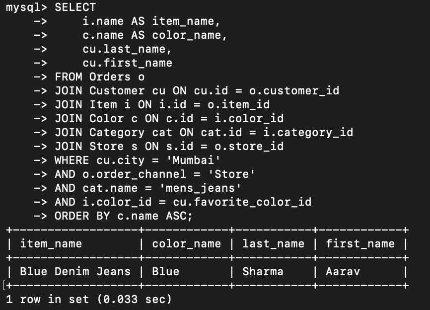
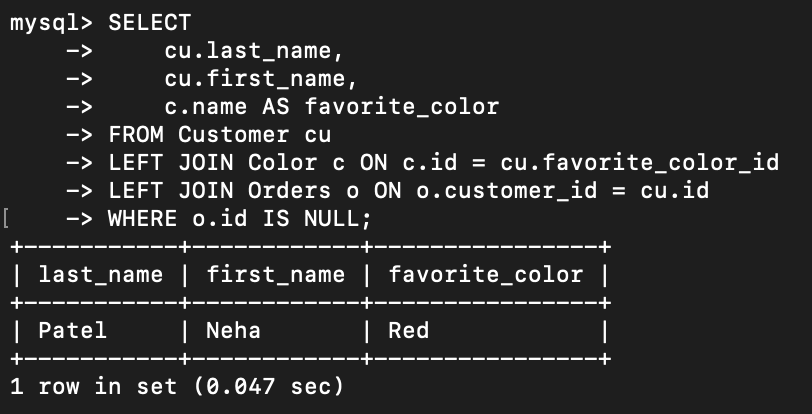
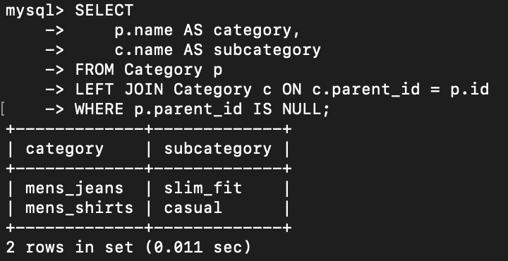

# Advanced SQL Assignment - Query Documentation

## Overview
This document explains the SQL queries written in advancedAssignment.sql.
The assignment uses a sportswear schema and covers joins, filtering, unmatched records, and self-joins.

## Database Tables Used
- Color: color master data and extra fee
- Customer: customer details and favorite color
- Category: product categories with parent-child hierarchy
- Item: product details including color and category
- Orders: order transactions
- Store: store location details

## Query Breakdown

### Query 1: Items Bought in Favorite Color (Mumbai, Store, mens_jeans)
Purpose:
Return item name, color name, and customer name for customers from Mumbai who bought mens_jeans through Store channel, where item color matches the customer's favorite color.

Key Concepts:
- Multi-table INNER JOIN
- Filter by city, channel, category
- Matching two related attributes (item color = favorite color)
- ORDER BY ascending color name

```sql
SELECT
    i.name AS item_name,
    c.name AS color_name,
    cu.last_name,
    cu.first_name
FROM Orders o
JOIN Customer cu ON cu.id = o.customer_id
JOIN Item i ON i.id = o.item_id
JOIN Color c ON c.id = i.color_id
JOIN Category cat ON cat.id = i.category_id
JOIN Store s ON s.id = o.store_id
WHERE cu.city = 'Mumbai'
AND o.order_channel = 'Store'
AND cat.name = 'mens_jeans'
AND i.color_id = cu.favorite_color_id
ORDER BY c.name ASC;
```



### Query 2: Customers With No Purchases
Purpose:
List customers who have never placed an order, along with their favorite color.

Key Concepts:
- LEFT JOIN to preserve all customers
- NULL filtering on Orders side
- Lookup join for favorite color

```sql
SELECT
    cu.last_name,
    cu.first_name,
    c.name AS favorite_color
FROM Customer cu
LEFT JOIN Color c ON c.id = cu.favorite_color_id
LEFT JOIN Orders o ON o.customer_id = cu.id
WHERE o.id IS NULL;
```



### Query 3: Main Categories and Direct Subcategories
Purpose:
Show each main category and its direct child category (if present).

Key Concepts:
- Self JOIN on Category table
- Parent-child hierarchy mapping
- LEFT JOIN to include parent categories with no children

```sql
SELECT
    p.name AS category,
    c.name AS subcategory
FROM Category p
LEFT JOIN Category c ON c.parent_id = p.id
WHERE p.parent_id IS NULL;
```

